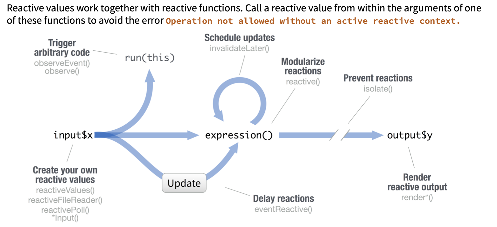
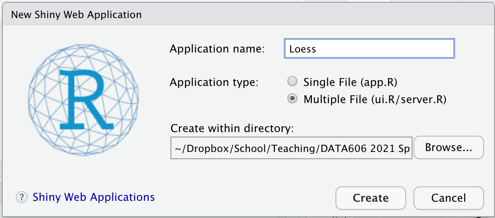

<style>
div.footnotes {
  position: absolute;
  bottom: 0;
  margin-bottom: 10px;
  width: 80%;
  font-size: 0.6em;
}
.forceBreak { -webkit-column-break-after: always; break-after: column; }
</style>
<!-- Use for forced two column break: <p class="forceBreak"></p> -->

<script src="https://ajax.googleapis.com/ajax/libs/jquery/3.1.1/jquery.min.js"></script>
<script>
$(document).ready(function() {
  $('slide:not(.backdrop):not(.title-slide)').append('<div class=\"footnotes\">');

  $('footnote').each(function(index) {
    var text  = $(this).html();
    var fnNum = (index+1).toString();
    $(this).html(fnNum.sup());

    var footnote   = fnNum + '. ' + text + '<br/>';
    var oldContent = $(this).parents('slide').children('div.footnotes').html();
    var newContent = oldContent + footnote;
    $(this).parents('slide').children('div.footnotes').html(newContent);
  });
});
</script>

<style>
/* https://stackoverflow.com/questions/43257725/shiny-app-size-in-ioslides */
/* Resize embedded shiny apps */
slides > slide {
  width: 1000px;
  height: 800px;
  top: 360px;
}
iframe {
  height: 800px;
}
</style>

<style>
table,
.table-condensed,
table.rmdtable {
  width: auto;
  margin-left: auto;
  margin-right: auto;
}
table,
.table-condensed,
table.rmdtable,
table.rmdtable .header th,
.table > thead > tr > th {
  border-collapse: collapse;
  border-style: solid;
  border-spacing: 0;
  border-width: medium 0 medium 0;
  border-color: inherit
}
table.rmdtable th,
table.rmdtable td,
table th,
table.rmdtable tr > td:first-child,
table.rmdtable .even {
  font-size: 100%;
  padding: 0.2em 0.5em;
  color: inherit;
  background: #FFF;
  font-weight: normal;
}
.table > tbody > tr > td {
  border-width: 0;
}
</style>


```{r setup, include=FALSE}
knitr::opts_chunk$set(echo = TRUE, error = FALSE, warning = FALSE, message = FALSE)
options(width = 110)

library(tidyverse)
library(shiny)
library(DATA606)
library(fontawesome)
```

## What is Shiny?


"Shiny is an R package that makes it easy to build interactive web apps straight from R. You can host standalone apps on a webpage or embed them in R Markdown documents or build dashboards. You can also extend your Shiny apps with CSS themes, htmlwidgets, and JavaScript actions." (shiny.rstudio.com)

<br/><br/>

To install:

```{r, eval  = FALSE}
install.packages('shiny')
```

# Examples

----

```{r, echo=FALSE, eval=TRUE}
shinyAppDir(
  'old_faithful/',
  options = list(width = "100%", height = 700)
)
```

----

```{r, echo=FALSE, eval=TRUE}
shinyAppDir(
	system.file('shiny/distributions', package = 'DATA606'),
	options = list(width = '100%', height = 700)
)
```

## More Examples

[RStudio Shiny Gallery](https://shiny.rstudio.com/gallery/) - Lots of great Shiny apps to get inspiration.

[data.osepartnership.org](https://data.osepartnership.org) - A Shiny application built to help special educators in NYS get information about schools and school districts meeting IDEA requirements.

[Linear Models with Two IVs](https://shiny.rit.albany.edu/stat/mod2/) - This application has a three dimensional plot. See other stats apps by Dr. Dudek [here](https://www.albany.edu/psychology/statistics/).

# Anatomy of a Shiny App

## Application Template

Shiny applications are divided into two components, the user interface and the server (i.e. business logic). Applications can be written in a single R script (typically named `app.R`). For example, the following is the most basic Shiny applicaiton (that does nothing):

```{r, eval = FALSE}
library(shiny)
ui <- fluidPage()
server <- function(input, output) { }
### <b>
shinyApp(ui = ui, server = server)
### </b>
```

Alternatively Shiny applications can be written across separate files:

* `ui.R` - Defines the user interface.
* `server.R` - Defines the business logic.
* `global.R` (optional) - Contains code that is common to both the UI and server components.

## ui.R

The user interface begins with a call to the `shinyUI` function. Here, we are using a `fluidPage` layout. We will discuss more layouts later.

The `ui.R` source for the Old Faithful app:

```{r, eval=FALSE}
shinyUI(fluidPage(
    titlePanel("Old Faithful Geyser Data"),
    sidebarLayout(
        sidebarPanel(
            sliderInput("bins",
                        "Number of bins:",
                        min = 1,
                        max = 50,
                        value = 30)
        ),
        mainPanel(
            plotOutput("distPlot")
        )
    )
))
```

The important part of the `ui.R` script is to define the inputs (i.e. controls that the user can change values) and the placement of outputs created in the `server.R` script (e.g. plots, tables, text, etc.). Most user inputs are functions of the format `xxxInput` where `xxx` is the type of input.

## server.R

All the R code that builds outputs (e.g. plots, tables, text, etc.) that can (but don't have to) use values from the inputs is contained in the `server.R` script. This is done by implementing procedures within `renderXXX` functions where `XXX` refers to the type of output. For example, `renderPlot` should contain code that returns a plot. The placement of the plot is defined in `ui.R` using the `plotOutput` function call.

```{r}
ls('package:shiny')[grep('^render', ls('package:shiny'))]
```

The `server.R` source for the Old Faithful app:

```{r, eval=FALSE}
shinyServer(function(input, output, session) {
    output$distPlot <- renderPlot({
        x    <- faithful[, 2]
        bins <- seq(min(x), max(x), length.out = input$bins + 1)
        hist(x, breaks = bins, col = 'darkgray', border = 'white')

    })
})
```

## global.R (optional)

The `global.R` script is optional. This file is run once while the application is started up and any objects created in this script are available within both `ui.R` and global.R`. Common uses for this file include:

* Loading R packages.
* Loading data.
* Establish database connections.
* Data munging (be careful that this doesn't take a long time since this will be run everytime the applications starts).

All objects created in `global.R` are available to all application users, that is, they are part of the applications global environment. When the `shinyServer` function is called for each user, a new child environment is created for that user.


----

<center></center>


----

<center></center>


## Numeric Inputs

```{r}
numericInput('numeric_id', 'Numeric example', value = 42, min = 0, max = 100, step = 1)
```

<br/><br/>

```{r}
sliderInput('slider_id', 'Slider example', min = 0, max = 100, step = 1, value = 42)
```

## Text Inputs

```{r}
textInput('text_id', 'Text example', value = 'You can type here!')
```

<br/><br/>

```{r}
textAreaInput('textarea_id', 'Text area example', value = 'Initial text', cols = 100, rows = 3)
```

<br/><br/>

```{r}
passwordInput('password_id', 'Password example', value = "Can't see this")
```

## Date Inputs

```{r}
dateInput('date_id', 'Date example')
```

<br/><br/>

```{r}
dateRangeInput('daterange_id', 'Date range example')
```

## Select Inputs

```{r}
choices <- LETTERS
names(choices) <- paste0('Brought you by the letter ', choices)
selectInput('select_id', 'Select example', choices = choices, multiple = FALSE, width = '80%')
```

<br/><br/>

```{r}
checkboxInput('checkbox_input', 'Checkbox example', value = FALSE)
```

<br/><br/>

```{r}
checkboxGroupInput('checkboxgroup_id', 'Checkbox group example', choices = LETTERS[1:3])
```

## Buttons

```{r}
submitButton('Submit Button')
```

<br/><br/>

```{r}
actionButton('action_id', 'Action Button')
```

## Formatting Text

There are R functions corresponding to most HTML tags. These can be used within the `ui.R` script.

<br/><br/>

<div style="float: left; width: 50%;">

Shiny Function  | HTML<br/>Equivalent  | Creates
----------------|------------------|--------------------------------------------
`p`             | `<p> `           | A paragraph of text
`h1`            | `<h1>`           | A first level header
`h2`            | `<h2>`           | A second level header
`h3`            | `<h3>`           | A third level header
`h4`            | `<h4>`           | A fourth level header
`h5`            | `<h5>`           | A fifth level header
`h6`            | `<h6>`           | A sixth level header
`a`             | `<a>`            | A hyper link (need `href` parameter)  

</div>
<div style="float: right; width: 50%;">

Shiny Function  | HTML<br/>Equivalent  | Creates
----------------|------------------|--------------------------------------------
`br`            | `<br>`           | A line break
`div`           | `<div>`          | A division of text with a uniform style
`pre`           | `<pre>`          | Unformatted text
`code`          | `<code>`         | A formatted block of code
`img`           | ``          | An image (need `src` parameter)
`strong`        | `<strong>`       | Bold text
`em`            | `<em>`           | Italicized text
`HTML`          |                  | HTML code passed directly to the browser

</div>

## Layouts

```{r, echo=FALSE, eval=TRUE}
shinyAppDir(
  'ShinyLayouts/',
  options = list(width = "100%", height = 400)
)
```

## Layouts Source

```{r, eval=FALSE}
library(shiny)

ui <- navbarPage('Shiny Layouts',
    tabPanel('Columns',
             fluidRow(
                 column(1, p('Row 1 Column 1')),
                 column(1, p('Row 1 Column 2')),
                 column(1, p('Row 1 Column 3')),
                 column(1, p('Row 1 Column 4')),
                 column(1, p('Row 1 Column 5')),
                 column(1, p('Row 1 Column 6')),
                 column(1, p('Row 1 Column 7')),
                 column(1, p('Row 1 Column 8')),
                 column(1, p('Row 1 Column 9')),
                 column(1, p('Row 1 Column 10')),
                 column(1, p('Row 1 Column 11')),
                 column(1, p('Row 1 Column 12')),
             ),
             fluidRow(
                 column(4, p('Row 1 3 columns')),
                 column(4, p('Row 1 3 columns')),
                 column(4, p('Row 1 3 columns'))
             )
    )
)

server <- function(input, output) { }

shinyApp(ui = ui, server = server)
```

## Sidebar Layout with Tabs

```{r, echo=FALSE, eval=TRUE}
shinyAppDir(
  'Regression/',
  options = list(width = "100%", height = 700)
)
```

## Sidebar Layout with Tabs Source

```{r, eval=FALSE}
data(mtcars)

ui <- fluidPage(
	titlePanel("Linear Regression with mtcars"),
	sidebarLayout(
	  sidebarPanel(
	  	selectInput('x', 'Independent Variable', choices = names(mtcars), selected = 'wt'),
	  	selectInput('y', 'Dependent Variable', choices = names(mtcars), selected = 'mpg')
	  ),
	  mainPanel(
	  	tabsetPanel(
	  		tabPanel("Plot", plotOutput("plot")),
	  		tabPanel("Summary", verbatimTextOutput("summary")),
	  		tabPanel("Table", tableOutput("table"))
	  	)
	  )
	)
)

server <- function(input, output) {
	output$plot <- renderPlot({
		ggplot(mtcars, aes_string(x = input$x, y = input$y)) +
			geom_smooth(method = 'lm', formula = y ~ x, se = FALSE) + geom_point()
	})
	output$summary <- renderPrint({
		lm(as.formula(paste0(input$y, ' ~ ', input$x)), data = mtcars) %>% summary()
	})
	output$table <- renderTable({ return(mtcars) })
}

shinyApp(ui = ui, server = server)
```


## Panels

Combine multiple elements into a "single element" that has its own properties with a panel function. 

```{r}
ls('package:shiny')[grep('Panel$', ls('package:shiny'))]
```


# Reactive Programming

## Reactivity

<center></center>

## Reactivity Objects <footnote>See https://shiny.rstudio.com/articles/reactivity-overview.html for more details.</footnote>

There are three types of objects in reactive programming:

1. Reactive sources (objects in the `input` object)

2. Reactive conductors (typically functions implemented using the `reactive` or `observe` function definitions)

3. Reactive endpoints (objects in the `output` object)

<center>

</center>


## Simple Example {.columns-2}

The simplest program has one input and one endpoint.

<center>

</center>

Shiny maintains the relationship between inputs and endpoints. When an input is changed, Shiny will determine all endpoints that use that input and mark them stale triggering a re-execution of the `render` function(s).

<p class="forceBreak"></p>

<center>

</center>

```{r, eval=FALSE}
server <- function(input, output) {
  output$distPlot <- renderPlot({
    hist(rnorm(input$obs))
  })
}
```

In this example, as the user changes the `obs` input, the `renderPlot` function assigned to the `output$distPlot` object will be executed.

Try it at https://gallery.shinyapps.io/01_hello/

## Multiple inputs and endpoints {.columns-2}

Consider this slighlty more complicated example...

```{r, eval=FALSE}
server <- function(input, output) {
  output$plotOut <- renderPlot({
    hist(faithful$eruptions, 
    	 breaks = as.numeric(input$nBreaks))
    if (input$individualObs)
      rug(faithful$eruptions)
  })

  output$tableOut <- renderTable({
    if (input$individualObs) {
      faithful
    } else {
      NULL
    }
  })
}
```

<p class='forceBreak'></p>

The following figure represents the relationship between inputs and endpoints.

<center>

</center>

When the user changes `nBreaks`, `output$plotOut` is updated.

When the user changes `individualObs`, both `output$plotOut` and `output$tableOut` are updated.


## Reactive Conductors

```{r}
shinyApp(
	ui = fluidPage(actionButton('addone', 'Add One'),
				   p('Counter 1: ', textOutput('counter1')),
				   p('Counter 2: ', textOutput('counter2')) ),
	server = function(input, output) {
		clicks <- 0
		output$counter1 <- renderText({ input$addone; clicks <<- clicks + 1; return(clicks) })
		output$counter2 <- renderText({ input$addone; clicks <<- clicks + 1; return(clicks) })
	}
)
```


## Reactive Conductors

It is possible to have reactive components between inputs and endpoints, these are called reactive conductors. Consider this graph:

<center>

</center>

A conductor can both be a dependent and have dependents. In other words, it can be both a parent and child in a graph of the reactive structure. Sources can only be parents (they can have dependents), and endpoints can only be children (they can be dependents) in the reactive graph.

To fix our counter problem, we can define a reactive conductor that responds to the action button and the endpoints call that conductor to get the current count. Shiny is aware that the reactive conductor only needs to be called once per click and so subsequent calls will not re-execute but simply use the most up-to-date value.

## Reactive Conductors

```{r}
shinyApp(
	ui = fluidPage(actionButton('addone', 'Add One'),
				   p('Counter 1: ', textOutput('counter1')),
				   p('Counter 2: ', textOutput('counter2')) ),
	server = function(input, output) {
		clicks <- 0
		counter <- reactive({ input$addone; clicks <<- clicks + 1; return(clicks) })
		output$counter1 <- renderText({ counter() })
		output$counter2 <- renderText({ counter() })
	}
)
```

## Reactive Conductors for Performance

Reactive conductors can be useful for encapsulating slow or computationally expensive operations. For example, imagine that you have this application that takes a value `input$n` and prints the n<sup>th</sup> value in the Fibonacci sequence, as well as the inverse of n<sup>th</sup> value in the sequence plus one. On a reasonably fast modern machine, setting `input$n` to 30 takes about 15 seconds to calculate the answer, largely because `fibonacci()` is run twice.

```{r, eval=FALSE}
# Calculate nth number in Fibonacci sequence
fibonacci <- function(n) ifelse(n<3, 1, fib(n-1)+fib(n-2))
shinyApp(
	ui = fluidPage(),
	server = function(input, output) {  
		output$nthValue    <- renderText({ fibonacci(as.numeric(input$n)) })
		output$nthValueInv <- renderText({ 1 / fibonacci(as.numeric(input$n)) })
	}
)
```

On a reasonably fast modern machine, setting input$n to 30 takes about 15 seconds to calculate the answer, largely because `fibonacci()` is run twice.

```{r, eval=FALSE}
server <- function(input, output) {
  currentFibonacci   <- reactive({ fibonacci(as.numeric(input$n)) })
  output$nthValue    <- renderText({ currentFibonacci() })
  output$nthValueInv <- renderText({ 1 / currentFibonacci() })
}
```

# Demo

## Getting Started

We want to convert this R script into a Shiny application where the user can modify the `span` parameter to the `loess` function and the value of `center`.

```{r, eval=FALSE}
df <- tibble(
	x = seq(-1, 1, by = 0.01),
	y = x^3 + rnorm(length(x), mean = 0, sd = 0.05) - x
)

center <- -0.3
span <- 0.3

loess.out <- loess(y ~ x, data = df, degree = 1, span = span)
df <- df %>% mutate(fitted = fitted(loess.out))

df.points <- df %>%
	mutate(dist = abs(x - center)) %>%
	filter(rank(dist) / n() <= span) %>%
	mutate(weight = (1 - (dist / max(dist)) ^ 3) ^ 3)

ggplot(df.points, aes(x = x, y = y)) +
	geom_vline(xintercept = center, linetype = 2) +
	geom_point(data = df, alpha = 0.5, shape = 1) +
	geom_point(aes( color = weight)) +
	geom_smooth(method = 'lm', formula = y ~ x, aes(weight = weight),
				se = FALSE, color = 'blue', size = 0.5) +
	scale_color_gradient2(low = '#ece7f2', high = '#2b8cbe') +
	geom_line(data = df, aes(y = fitted), color = 'black', size = 0.5)
```

## Output {.centered}

```{r, eval=TRUE, echo=FALSE}
df <- tibble(
	x = seq(-1, 1, by = 0.01),
	y = x^3 + rnorm(length(x), mean = 0, sd = 0.05) - x
)

center <- -0.3
span <- 0.3

loess.out <- loess(y ~ x, data = df, degree = 1, span = span)
df <- df %>% mutate(fitted = fitted(loess.out))

df.points <- df %>%
	mutate(dist = abs(x - center)) %>%
	filter(rank(dist) / n() <= span) %>%
	mutate(weight = (1 - (dist / max(dist)) ^ 3) ^ 3)

ggplot(df.points, aes(x = x, y = y)) +
	geom_vline(xintercept = center, linetype = 2) +
	geom_point(data = df, alpha = 0.5, shape = 1) +
	geom_point(aes( color = weight)) +
	geom_smooth(method = 'lm', formula = y ~ x, aes(weight = weight),
				se = FALSE, color = 'blue', size = 0.5) +
	scale_color_gradient2(low = '#ece7f2', high = '#2b8cbe') +
	geom_line(data = df, aes(y = fitted), color = 'black', size = 0.5)
```

## Getting Started

In RStudio, click `File` -> `New File` -> `Shiny Web App...`

<center>

</center>

Now we'll fill in the pieces.

## Solution {.columns-2}

#### `global.R`

```{r, eval=FALSE}
library(shiny)
library(tidyverse)

df <- tibble(
	x = seq(-1, 1, by = 0.01),
	y = x^3 + rnorm(length(x), mean = 0, sd = 0.05) - x
)
```

#### `ui.R`

```{r, eval=FALSE}
shinyUI(fluidPage(
    titlePanel("Loess Regression"),
    sidebarLayout(
        sidebarPanel(
            sliderInput("center", "Center:",
                        min = min(df$x), max = max(df$x),
                        value = min(df$x), step = 0.01),
            numericInput("span", "Span:",
                         min = 0, max = 5,
                         value = 0.5, step = 0.1)
        ),

        mainPanel(
            plotOutput("loessPlot")
        )
    )
))
```

<p class='forceBreak'></p>

#### `server.R`

```{r, eval=FALSE}
shinyServer(function(input, output) {
    getData <- reactive({
        loess.out <- loess(y ~ x, data = df, degree = 1, span = input$span)
        df %>% mutate(fitted = fitted(loess.out))
    })

    getWeightedData <- reactive({
        getData() %>%
            mutate(dist = abs(x - input$center)) %>%
            filter(rank(dist) / n() <= input$span) %>%
            mutate(weight = (1 - (dist / max(dist)) ^ 3) ^ 3)
    })

    output$loessPlot <- renderPlot({
        df <- getData()
        df.points <- getWeightedData()

        ggplot(df.points, aes(x = x, y = y)) +
            geom_vline(xintercept = input$center, linetype = 2) +
            geom_point(data = df, alpha = 0.5, shape = 1) +
            geom_point(aes(color = weight)) +
            geom_smooth(method = 'lm', formula = y ~ x, aes(weight = weight),
                        se = FALSE, color = 'blue', size = 0.5) +
            scale_color_gradient2(low = '#ece7f2', high = '#2b8cbe') +
            geom_line(data = df, aes(y = fitted), color = 'black', size = 0.5) +
            xlim(-1, 1) + ylim(-0.5, 0.5)
    })

})
```


# Resources

## Deploying Shiny Apps

[Deploying Shiny Server on Digital Ocean tutorial](https://www.digitalocean.com/community/tutorials/how-to-set-up-shiny-server-on-ubuntu-16-04).

[Deploying Shiny Server on Amazon AWS](https://towardsdatascience.com/how-to-host-a-r-shiny-app-on-aws-cloud-in-7-simple-steps-5595e7885722)

[Framework for Shiny Apps in R Packages](https://bryer.org/post/2021-02-12-shiny_apps_in_r_packages/)

[`golem` is an opinionated framework for building production-grade shiny applications](https://github.com/ThinkR-open/golem)


## Supplemental Packages

* [shinythemes](https://github.com/rstudio/shinythemes) - Bootswatch themes (Bootstrap 3) for Shiny

* [shinydashboard](https://github.com/rstudio/shinydashboard) - Shiny dashboarding framework based on AdminLTE 2

* [shinyWidgets](https://github.com/dreamRs/shinyWidgets) - Bootstrap 3 custom widgets for Shiny

* [DT](https://github.com/rstudio/DT) - An R interface to the DataTables library

* [DTedit](https://github.com/jbryer/DTedit) - Editable DataTables for shiny apps

* [fontawesome](https://github.com/rstudio/fontawesome) - R package makes it very easy to insert Font Awesome icons into R Markdown documents and Shiny apps

* [leaflet](https://github.com/rstudio/leaflet) - An R Interface to Leaflet Maps

See [Awesome Shiny Extensions](https://github.com/nanxstats/awesome-shiny-extensions) page for a comprehensive list of addon packages.


## Additional Resources

[Rstudio Shiny Website](https://shiny.rstudio.com) includes [reference documentation](https://shiny.rstudio.com), [gallery of apps](https://shiny.rstudio.com/gallery/), and [articles](https://shiny.rstudio.com/articles/) to get started.

[Mastering Shiny](https://mastering-shiny.org/) by Hadley Wickham book.

[Shiny Cheat Sheet](https://shiny.rstudio.com/articles/cheatsheet.html)

<center>

</center>

## Thank You!

<br/><br/><br/>

You'll be able to download this presentation later from [spring2021.data606.net](https://spring2021.data606.net).

<br/><br/><br/>

`r fa('envelope')` [jason.bryer@cuny.edu](mailto:jason.bryer@cuny.edu)

`r fa('link')` [bryer.org](https://bryer.org)

`r fa('twitter')` [\@jbryer](https://twitter.com/jbryer)

`r fa('github')` [Github](https://github.com/jbryer)


